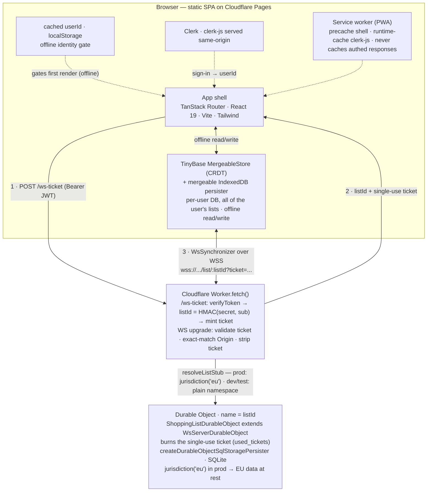

# Architecture

Per-user, local-first shopping list: offline read+write on every device, auto-merge across a user's
devices, and list content at rest in the EU.

> New to an acronym here? See the [glossary](../reference/glossary.md).

## Test coverage

Client logic runs under Vitest (jsdom) in
`src/client/**`; the sync server runs under `@cloudflare/vitest-pool-workers` (miniflare) in
`src/server/__tests__/`. Two Playwright tiers exercise the browser:

- **Local-only** ([../../e2e/local/](../../e2e/local/)) — offline cold-boot, drag reorder, multi-tab
  persistence. Runs against a `vite preview` build with the sync server off (`VITE_SYNC_URL` empty)
  and Clerk's network blocked, so the app boots from a seeded cached identity
  ([../../e2e/local/fixtures.ts](../../e2e/local/fixtures.ts)). Hermetic, so it runs unconditionally
  in CI. It runs twice, once per viewport project — a phone and a desktop — because the responsive
  tiers key off media queries, and `matchMedia` is absent under jsdom.
- **Sync** ([../../e2e/sync/](../../e2e/sync/),
  [../../playwright.config.sync.ts](../../playwright.config.sync.ts)) — real Clerk via
  `@clerk/testing` against a local `wrangler dev` Worker, provisioning a fresh `+clerk_test` user
  per test (each gets an isolated HMAC-derived sync unit, so a clean Durable Object). Covers live
  two-context CRDT merge, cross-user isolation, and sign-out clearing local data. CI runs it only
  when `CLERK_SECRET_KEY` is present.

Source: [../../src/client/store/](../../src/client/store/),
[../../src/client/components/](../../src/client/components/),
[../../src/server/](../../src/server/).

## Diagram

Renders on GitHub. The numbered edges are the connection handshake in order.

## Components

| Component | Role | Location |
|---|---|---|
| SPA shell | Routing, auth UI, app shell. A pathless `_app` layout route sits between the root and the per-list routes: the cached-identity gate, `StoreProvider`, the single `useSync` call and the roster-repair subscription mount there, above the `/lists/$listId` boundary, so switching lists never remounts the store or restarts the socket. `useSync`'s result reaches the list view through a context rather than the `Outlet` | [../../src/client/routes/__root.tsx](../../src/client/routes/__root.tsx), [../../src/client/routes/](../../src/client/routes/), [../../src/client/store/syncStatus.ts](../../src/client/store/syncStatus.ts), [../../src/client/router.tsx](../../src/client/router.tsx) |
| Clerk (client) | Identity provider: `ClerkProvider` + `useAuth` | [../../src/client/routes/__root.tsx](../../src/client/routes/__root.tsx), [../../src/client/env.ts](../../src/client/env.ts) |
| Cached identity gate | `{userId}` in localStorage; renders the app offline, independent of Clerk readiness | [../../src/client/store/identity.ts](../../src/client/store/identity.ts) |
| Local store | TinyBase `MergeableStore` (CRDT) ⇄ a mergeable `IndexedDB` persister that preserves HLCs and tombstones across reload; DB `shopping-<userId>` | [../../src/client/store/schema.ts](../../src/client/store/schema.ts), [../../src/client/store/store.ts](../../src/client/store/store.ts), [../../src/client/store/persister.ts](../../src/client/store/persister.ts) |
| Shopping list UI | The active list's items in two sections (unchecked/checked), search, rename, quantity, delete, drag-reorder — wrapped by a view that also carries the header's sync/account controls and the two dialogs | [../../src/client/components/ShoppingList/](../../src/client/components/ShoppingList/), [../../src/client/components/ListView.tsx](../../src/client/components/ListView.tsx) |
| Account button | The avatar's fixed seat in the header: Clerk's `UserButton` (carrying the language action), the dashed placeholder that holds the seat until Clerk resolves, and the sync badge pinned to its corner | [../../src/client/components/AccountButton.tsx](../../src/client/components/AccountButton.tsx), [../../src/client/components/SyncStatus.tsx](../../src/client/components/SyncStatus.tsx) |
| List picker | A bottom sheet on a phone and a centred dialog above `sm`: switch list, and an edit mode to create, rename, reorder and delete lists — mounted above the keyed `<ShoppingList>` so a switch can't unmount it mid-interaction. Above `lg` switching moves to the sidebar and only edit mode opens | [../../src/client/components/ListPicker.tsx](../../src/client/components/ListPicker.tsx), [../../src/client/components/ConfirmDialog.tsx](../../src/client/components/ConfirmDialog.tsx) |
| Lists sidebar | The roster standing beside the list above `lg`: a `nav` landmark of pickable rows, sharing one row rendering with the picker sheet. Its Edit opens the sheet straight into edit mode | [../../src/client/components/ListSidebar.tsx](../../src/client/components/ListSidebar.tsx), [../../src/client/components/RosterRows.tsx](../../src/client/components/RosterRows.tsx) |
| Lists roster | Virtual default row, the gated default-list migration, list CRUD, the orphan sweep and position backfill | [../../src/client/store/lists.ts](../../src/client/store/lists.ts) |
| Sign-out teardown | Deletes the local IndexedDB replica and broadcasts to peer tabs on any signed-out transition | [../../src/client/store/teardown.ts](../../src/client/store/teardown.ts) |
| Service worker | Precache the SPA shell; runtime-cache the same-origin `clerk-js` served from `/clerk-js/`; the sync Worker origin stays network-only | [../../vite.config.ts](../../vite.config.ts) |
| Content-Security-Policy | [../../csp/dev.headers](../../csp/dev.headers) is committed and host-pinned for dev/preview; production resolves [../../csp/prod.headers.template](../../csp/prod.headers.template) into `dist/_headers` at build time so no deployment host is committed (see [../adr/0011-deployment-identifiers-out-of-repo.md](../adr/0011-deployment-identifiers-out-of-repo.md)); `yarn check:csp` — a gate CI and `yarn deploy:spa` run, not `yarn build` — fails on drift between the two, a stray placeholder, a `dist/` with no policy, or a Report-Only template without an explicit opt-in | [../../scripts/check-csp.ts](../../scripts/check-csp.ts), [../../scripts/gen-headers.ts](../../scripts/gen-headers.ts) |
| `/ws-ticket` endpoint | Verifies the Clerk JWT (`verifyClerkUser`), derives `listId` and mints a single-use WS ticket (`deriveListId`, `mintTicket`) | [../../src/server/index.ts](../../src/server/index.ts), [../../src/server/clerk.ts](../../src/server/clerk.ts), [../../src/server/auth.ts](../../src/server/auth.ts) |
| WS upgrade handler | Validates the ticket and checks `Origin` (`verifyTicket`, `originAllowed`), forwards to the EU Durable Object, which burns the ticket | [../../src/server/index.ts](../../src/server/index.ts), [../../src/server/auth.ts](../../src/server/auth.ts) |
| Durable Object | `ShoppingListDurableObject`, one per derived `listId` — i.e. one sync unit per user, carrying all of their lists — `jurisdiction('eu')` in prod, SQLite-backed | [../../src/server/durable-object.ts](../../src/server/durable-object.ts) |

Constraints met: **local-first** (CRDT in IndexedDB, offline r/w, conflict-free), **EU residency**
(the DO is pinned `eu`), and **per-user with a path to sharing** (one DO per sync unit — one per
user today, holding every list they own; a membership layer is addable later without re-keying — see
[../adr/0006-deterministic-hmac-listid.md](../adr/0006-deterministic-hmac-listid.md)).

## Design & UX

Decisions that aren't obvious from the markup:

- **Responsive tiers** — the app is a single column, capped at `28rem` on a phone and `42rem` above
  `md`; at `lg` the roster comes out of its modal and stands beside it as a sidebar
  ([../adr/0016-roster-two-homes-by-width.md](../adr/0016-roster-two-homes-by-width.md)). The
  phone-shaped compromises inside that column are conditional rather than universal. Three
  properties decide, and all are read through `useMediaQuery`
  ([../../src/client/components/media.ts](../../src/client/components/media.ts)): room for the
  sidebar (`lg`), a precise **pointer**, and the two together (`md` and precise) for the header's
  scroll reclaim. Pointer, not width alone, because a tablet in landscape is as
  wide as a laptop while being half as tall and about to lose a third of that to a soft keyboard —
  the case where reclaiming vertical space still earns its complexity. There is deliberately no
  height term: a short desktop window keeps the tall header, which is the trade for not carrying a
  second threshold that would flap as the window resizes. `matchMedia` is absent under
  jsdom, so every branch these queries gate reports `false` there and is covered by the e2e tier
  instead ([../reference/testing.md](../reference/testing.md)); a component with unit assertions to
  keep takes the answer as a prop rather than reading it, so both of its branches stay reachable.
- **Lists & the picker** — below `lg` the header title is the active list's name *and* the button
  that opens the list picker: a bottom sheet forked from the language chooser (scrim,
  `role="dialog"` + `aria-modal`, a trapped Tab), which **centres itself above `sm`** and swaps its
  slide-up for the same fade the other two dialogs use — a sheet rising from the bottom edge of a
  wide window reads as a phone gesture that lost its phone, and above `sm` all three dialogs agree.
  At `lg` the roster leaves the modal for a **sidebar** and the title becomes a title again; that
  swap and everything that follows from it is
  [../adr/0016-roster-two-homes-by-width.md](../adr/0016-roster-two-homes-by-width.md). Its rows are
  a **menu** of `menuitemradio`s, not a radiogroup:
  arrows rove without selecting, because selecting switches list and closes the sheet, so the first
  arrow press would end the interaction. The trigger carries **no `aria-label`** — the list name has
  to be the `<h1>`'s accessible name, at either width, or heading navigation and voice control both
  lose it. Because
  the trigger lives in the title band, that band **shrinks** on scroll — a shorter band, dropping the
  account button and its sync badge — instead of collapsing to nothing, so the picker stays reachable
  at any offset. The cost is a taller scrolled header. The shrink is **frozen on a wide screen with
  a precise pointer, and wherever the sidebar is on screen**: it buys vertical room a desktop never
  ran out of, freezing it stops the band twitching on every wheel tick, and beside the sidebar the
  title is a plain heading with no smaller size to shrink to. That band's side columns are **fixed at one
  avatar wide**, not `1fr`: with elastic columns, anything that changes the right cluster's width —
  the avatar arriving, a longer sync label — moves the centred title, a shift on every cold load and
  every reconnect. Each list shows its **unchecked** count only: the number you'd act on, so `0`
  reads as "nothing to do here". List management lives in the sheet's edit
  mode, and every action there leaves the sheet open — creating a list neither switches to it nor
  closes, so you can add several in one sitting: an inline new-list field, tap-to-rename reusing the
  row's input, a drag handle for ordering,
  and delete behind a confirmation nested inside the sheet, naming every item the delete destroys —
  checked included, which is why the roster carries both counts. Deleting the list you're standing on
  switches away and closes the sheet; deleting any other leaves it open. **Escape is decided in one
  place**, the sheet's own handler, so it can weigh what is in flight: it cancels a keyboard drag
  without closing (dnd-kit already reads Escape as cancel), it clears a half-typed list name rather
  than discarding it along with the sheet, and only otherwise closes. The inline rename input is the
  one exception, keeping `Enter` and `Escape` for itself — and only those two, so `Tab` still reaches
  the sheet's trap rather than being decided by native tab order. The active list is URL state
  (`/lists/$listId`, replacing rather than pushing so Back doesn't walk a switch history) plus a
  device-local last-used hint for `/` — deliberately not a synced value, same seam as the locale
  mirror. An id that no longer resolves redirects to the first list rather than a not-found screen.
  Switching resets the view: query cleared, any open editor closed, the checked section collapsed —
  all of it from remounting the list on a `key` rather than a reset routine. Scrolling to the top is
  the one explicit step, in the switch handler, because the page keeps its offset across a remount.
  Everything else about a switch is a client-side filter — one store per user holds every list, so
  there is no request and no loading state
  ([../adr/0013-multi-list-single-store.md](../adr/0013-multi-list-single-store.md)).
  [ListHeader.tsx](../../src/client/components/ShoppingList/ListHeader.tsx),
  [../../src/client/components/ShoppingList/](../../src/client/components/ShoppingList/).
- **Reorder** — dnd-kit, whole-row drag: press-and-hold on touch (220 ms activation delay so a
  vertical swipe still scrolls), 6 px on mouse, plus keyboard reorder; disabled while the
  add/search input is focused. The row is both the drag node and the registered **activator node**,
  and registering it as the activator is what scopes the keyboard sensor to the row: the sensor only
  compares a `Space`/`Enter` target against the activator when one exists, so without that
  registration the same keypress on a nested control lifts the row and suppresses the control's own
  click. A row that cannot currently be dragged carries none of the drag attributes at all and reverts
  to a plain list item, so it is neither a tab stop that does nothing nor an element claiming a widget
  state it has no role to hold; `data-draggable` is the signal that survives, for both styling and
  tests. Both drag surfaces also replace dnd-kit's built-in screen-reader copy, which is hardcoded
  English and interpolates the raw row id: the app supplies its own instructions, role description and
  start/move/drop/cancel announcements from the same typed dictionary as everything else, naming the
  **item or list** and its position. Items and lists get separate key sets rather than one with a noun
  slot, because French genders the article and the interpolator has no grammar.
  See [../adr/0008-dnd-kit-reorder.md](../adr/0008-dnd-kit-reorder.md).
- **Swipe-to-delete & undo** — on touch, a left-swipe reveals a growing red action pill that
  brightens past a one-third-width commit threshold. Only a finger-lift past the threshold commits;
  any `touchcancel` (edge back-swipe, shade pull, app-switch) springs back, so a destructive action
  never fires on an interrupted gesture. The undo window is **ten seconds and pauses on hover or
  focus**, because the snackbar is last in the DOM — several Tab presses away — and the delete has
  just
  moved focus onto a neighbouring row, so a short fixed window is unreachable by keyboard. If it does
  expire while the Undo button holds focus, the same restore that covers a delete catches the fall.
  A commit slides the row off and shows an Undo snackbar
  that restores the item via `store.setRow` under the same rowId, preserving its
  `(position, id)` order. The gesture tracks a single `Touch.identifier`, is suppressed during a
  drag, and is blocked from starting (but never torn down) while syncing. Delete is also reachable
  without touch via the row's edit mode — the same path in every row variant, checked and search rows
  included: activate the name to open the inline editor, then Tab to the Delete it reveals, which an
  `onBlur` guard keeps alive precisely so that Tab works. On a **precise pointer** that same Delete
  is also present outside edit mode, faded out until the row is hovered — a mouse cannot swipe, and
  the editor detour is the only path it otherwise has. It is deliberately **not a tab stop**
  (`tabIndex={-1}` until the row is being renamed): a keyboard user already has the editor path, and
  a control per row would add one stop for every item to cross the list. One button serves both
  cases, so the `onBlur` guard and the Tab-to-Delete order are the same code either way.
  [../../src/client/components/ShoppingList/useSwipeToDelete.ts](../../src/client/components/ShoppingList/useSwipeToDelete.ts),
  [UndoSnackbar.tsx](../../src/client/components/ShoppingList/UndoSnackbar.tsx).
- **Announcements** — one polite `role="status"` region, mounted from the start and only ever swapping
  its text. A region that appears in the same commit as its content is the case VoiceOver and NVDA
  routinely miss, which is why it isn't rendered alongside the Undo snackbar it describes; the
  snackbar is the visual half only. It carries three messages, each a case where the app moves focus
  somewhere that doesn't explain what happened: a **delete**, because focus lands on the
  *neighbouring* row and nothing else says the item went or that Undo exists; **clearing checked
  items**, because the section vanishes and focus jumps to the header; and **checking an item off**
  from the unfiltered list, because the row unmounts into the checked section, destroying the button
  whose `aria-pressed` carried the state before the flip can be spoken, while focus moves on to a
  *different* item — silence there reads as the row having renamed itself. The two exceptions to that
  last one are the same rule read backwards: **unchecking**, and checking off a **search result**,
  both leave the row on screen with its own button still focused, so it states the change and a region
  message on top would be double-speak. Each message is written inside the same `hasRow` guard as the
  mutation it describes, not beside it — a view transition defers the write by a frame, and a row a
  peer deletes inside that frame must not be announced as checked off.
  Everything else is silent too — quantity is announced by
  the focused control's own text, Undo's restore by the focus move onto the restored row, and adding
  leaves focus in the field that just cleared. The search result count is the accessible **name of the
  results list** rather than an announcement: the field adds as well as finds, so someone typing a new
  item shouldn't hear match counts read at them. Over-announcing is its own accessibility bug.
- **Colour contrast** — the neutral ramp has a contract: `--color-faint` is for **decoration and
  disabled state only** (the offline dot, whose meaning the adjacent label repeats, and `disabled:`
  colours, which the minimums exempt as inactive), and `--color-muted` is the floor for anything a
  user has to read, click, or read *state* from. `faint` cannot carry content — it measures about
  2.4:1 on the canvas in light mode and 3.6:1 in dark, so it fails body text in both, and fails even
  the 3:1 non-text bar for an icon button. That is why the empty and no-match copy, checked item
  names, the quantity glyph, list counts, the picker's icon buttons and the **unselected** option
  indicators all sit on `muted`. That last one is the subtle case and the reason the rule is drawn
  around *state* rather than around text: an unselected radio's ring is the only thing distinguishing
  it from a selected one, so it is a UI component boundary owing 3:1, not decoration — and no
  automated gate here catches it, because axe measures text contrast only and has no non-text rule.
  `--color-accent-text` is the accent's *text* form, distinct
  from `--color-accent` (the butter-yellow fill, unchanged): it is tuned against the **canvas**, the
  worse of its two backgrounds, not against white, since that is the binding constraint. It also
  doubles as the focus-ring colour, so tuning it for text raises the ring's margin at the same time.
- **Focus visibility** — one house pattern, applied to every interactive control:
  `outline-hidden focus-visible:ring-2 focus-visible:ring-accent-text`, with `ring-inset` wherever the
  element clips (the row, whose `overflow-hidden` would cut an outset ring) and plain `focus:` rather
  than `focus-visible:` on text inputs, which should show focus however it arrived. `outline-hidden`
  rather than `outline-none` is load-bearing: rings are box-shadows, forced-colors modes strip
  box-shadows, and `outline-hidden` keeps a transparent outline that those modes repaint — so the
  indicator survives without a hand-written `forced-colors` block. Inline editors are marked by their
  background and a border, never by a permanent ring: the rename input deliberately keeps editing
  alive while focus moves to the row's Delete, so a ring that never leaves would claim focus that has
  gone elsewhere.
- **Modal containment** — the dialogs are hand-rolled `role="dialog"` elements with their own
  `keydown` Tab traps, not native `<dialog>`/`showModal()`: jsdom implements `HTMLDialogElement` as an
  empty subclass, so going native would move containment and Escape out of unit-test reach (see
  [../adr/0014-jsx-a11y-lint-rules.md](../adr/0014-jsx-a11y-lint-rules.md)). `aria-modal` alone only
  *claims* the page behind is unreachable, and a keydown trap has a blind spot — with focus on
  `<body>` there is no keydown to intercept. So the list is wrapped in an `inert` subtree whenever
  either dialog is open, which is a property of the tree rather than of a handler, and the sheet
  already does the same to itself while the nested confirmation is up. Focus restore survives it
  because closing clears `inert` in the same commit that unmounts the dialog, one frame before the
  deferred restore runs — the header trigger it reaches for lives inside that subtree.
- **Dialog naming** — each dialog is named by `aria-labelledby` pointing at its own visible `<h2>`,
  rather than an `aria-label` repeating the same words in a second place that can drift. The delete
  confirmation is an `alertdialog`, and its body — the sentence naming every item the delete
  destroys, and that it can't be undone — is wired as the accessible **description**, so it reaches
  assistive tech on arrival instead of only when the user reads past the title. The checked disclosure
  gets `aria-controls`, pointing at the panel it expands. Two state attributes are deliberately
  **absent**, both for the same underlying reason — an attribute that duplicates or contradicts what
  the element already says is worse than none. The picker trigger carries no `aria-expanded`:
  `aria-haspopup="dialog"` already says a dialog opens, `aria-expanded` describes content that expands
  in place, and while the sheet is open the trigger sits inside an `inert` subtree, so the value could
  never be read as anything but `false`. The Edit-lists toggle carries no `aria-pressed`: its label
  *is* the state, swapping between "Edit lists" and "Done", and a toggle button whose name changes
  should not also report a pressed state — the pair announces "Done, toggle button, pressed".
- **Landmarks & headings** — the items sit in a `<main>`, with the title band left outside it so it
  keeps its `banner` role, and above `lg` the roster is a `nav` beside them. Heading structure
  carries the two groups: the list name is the `<h1>` (and, below `lg`, the picker trigger), and the
  checked disclosure is an `<h2>`, so heading navigation can tell "still
  to buy" from "already in the basket" without reading through. There is deliberately **no skip
  link**: the add/find field lives inside the header, so skipping to the main landmark would jump past
  the app's most-used control, and a landmark already satisfies bypass-blocks on a single-screen app.
  There is nothing repeated across pages to bypass. The cost is that the sidebar's rows precede that
  field in tab order above `lg`, where landmark navigation is the way past them.
- **Focus & keyboard** — mutations that unmount the focused control return focus to a button rather
  than dropping it to `<body>`: rename/quantity commits refocus the row, delete moves to a
  neighbour, Undo returns to the restored item. **Checking an item off** is the frequent one, and it
  aims at the *next* unchecked row's check-off button — the row that slides into the vacated slot, so
  focus doesn't appear to move at all and Space walks straight down a list; the row above takes over
  when the last one is checked. Following the item into the checked section would be the symmetric
  choice and the wrong one: that section is collapsed and `inert` in the common case, so the focus
  would be silently refused. Two cases keep the item as their own target instead, because it never
  leaves the screen: **unchecking**, which remounts it further down the unchecked list, and a toggle
  inside a **filtered view**, which matches on the name rather than the checked flag and so only
  re-sorts the row — and whose rendered order isn't the list's order to walk down anyway.
  A row therefore registers two controls by item id — its name button for the mutations that leave
  the row in place, its check-off button for the one that walks down — and a restore names which of
  the two it wants. When there is no row left to return to — the last item deleted, the last unchecked
  item checked off, or the checked section cleared out from under the button that cleared it — focus
  falls back to the header title, the one button that always exists and stays visible at any scroll
  offset.
  Each reclaim waits for the mutation to actually land rather than for the next frame: a view
  transition defers the DOM change to a later frame, so a restore scheduled immediately still sees the
  old tree, decides nothing was lost, and does nothing — the control then disappears with no second
  attempt. jsdom has no View Transitions API, so this is a browser-only failure mode and the reason
  the animation helper takes an after-callback instead of the caller guessing a delay. Each only
  reclaims focus that was genuinely lost, so it never steals focus the user moved on purpose, and
  always targets a button so it can't pop the soft keyboard. The same rule holds through the picker's
  two nested layers: opening the sheet moves
  focus into it and closing returns it to the title trigger, and the delete confirmation — a dialog
  inside a dialog — returns focus to the row that opened it, not to whatever the DOM happened to
  leave focused. All three dialogs share one hook for this, and restore on the frame *after* they
  unmount rather than during cleanup: a switch remounts the header in the same commit that closes
  them, so the captured opener is still connected while cleanup runs and only dies afterwards —
  focusing it there would drop focus to `<body>`. The language chooser leans hardest on the fallback,
  because its opener is a Clerk menu item that unmounts along with the menu, so the captured node is
  normally detached by the time focus is handed back; the header title is the selector it falls back
  to, being the one control present and visible at any scroll offset.
  The header's sign-in link is the case where the control vanishes on its own schedule rather than on
  a reader's action: it renders only while sync reports `signin-required`, so a recovery mid-Tab would
  take focus with it. The rescue runs from the other end of the lifecycle — a *layout* effect's
  cleanup, the last moment the node is still connected and still focused, since a passive cleanup
  sees it detached and can't tell that from focus having moved on purpose. That makes the link a
  component of its own: the strip around it stays mounted through every status, so a hook inside the
  strip would never clean up.
  [focus.ts](../../src/client/components/focus.ts),
  [SyncNotice.tsx](../../src/client/components/SyncNotice.tsx).
  [../../src/client/components/ShoppingList/useListActions.ts](../../src/client/components/ShoppingList/useListActions.ts),
  [ItemRow.tsx](../../src/client/components/ShoppingList/ItemRow.tsx).
- **Internationalisation** — FR/EN via a typed dictionary
  ([../../src/client/i18n/](../../src/client/i18n/)); English keys are the source of truth, so a
  missing French key is a compile error, and `t(key, vars)` interpolates `{name}`/`{count}` and
  picks a `{ one, other }` plural form by `count` via the locale's `Intl.PluralRules`. The
  chosen language is a synced CRDT value (`VALUES_SCHEMA.locale`) mirrored to `localStorage` so it's
  readable above `StoreProvider` — that mirror drives both the app UI and Clerk's own strings
  (`@clerk/localizations`). The copy stays **neutral about what a list is for**: a list can be
  Hardware or Garden as easily as a weekly shop, so strings talk about items and lists rather than
  buying or shopping. (The product framing — the app's name, the manifest, this repo's README — is
  positioning, and stays.)
  [../../src/client/routes/__root.tsx](../../src/client/routes/__root.tsx).
- **Theme** — light and dark, following `prefers-color-scheme`. The butter accent holds in both and
  `--color-accent-text` swaps to a readable tone per theme. A lighter header (`--color-header`) over
  a darker canvas (`--color-canvas`) is held by dedicated tokens because `surface`/`surface-2` don't
  keep a consistent lightness order across themes. Clerk's own components follow the same light/dark
  via `@clerk/themes`. [../../src/client/styles.css](../../src/client/styles.css).
- **Motion** — add/check/delete animate through the View Transitions API (`flushSync` commits the
  store change before the API snapshots; each row carries a `view-transition-name`, and rows in a
  collapsed section render at `opacity: 0` so a named element isn't lifted out of its clip).
  The checked-section fold uses CSS `grid-template-rows`, and the title band's shrink is a CSS
  transition on the same scrolled flag — sized down to a shorter band rather than to zero, so the
  picker trigger is never unmounted mid-scroll. The list picker's entrance is **two keyframes chosen
  by breakpoint**, since a mount cannot be a transition and the sheet and the centred dialog arrive
  from different places; both are `@utility` declarations rather than plain classes, because only a
  utility accepts a `sm:` variant. The row's hover-revealed Delete is a plain opacity transition,
  the cheapest tier for a state change. Swipe-to-delete tracks the finger with a CSS
  transform and springs back with a CSS transition, and crossing the delete threshold plays a short
  CSS keyframe pulse. The sync badge breathes while connecting — a keyframe on scale alone, because
  it rides the avatar's corner: translating it reads as a piece coming loose, and fading it over a
  photo reads as a rendering glitch. The placeholder that holds the avatar's seat cross-fades out
  once Clerk resolves, which is why it overlays Clerk's own DOM (`pointer-events-none`) rather than
  sitting behind it — a placeholder that is merely covered can't fade. The avatar fades *in* over
  the same 250ms, as a keyframe rather than a transition (Clerk mounts the box only once its user
  resolves, so there is no from-state): a photo landing at full opacity over a glyph that is still
  on screen shows the glyph through any alpha it carries, and reads as a broken layer rather than
  as a transition. Motion is CSS-driven (no hand-rolled JS animation) and all of it is gated on
  `prefers-reduced-motion`.
  [../../src/client/components/ShoppingList/helpers.ts](../../src/client/components/ShoppingList/helpers.ts),
  [ItemRow.tsx](../../src/client/components/ShoppingList/ItemRow.tsx).
- **Scroll restoration** — page-level scroll under a sticky header; the offset is persisted to
  `sessionStorage` under a **per-list** key and re-applied before paint in a `useLayoutEffect` once
  rows exist. One shared key would restore list A's offset into list B, so the key carries the list
  id. Restoring is **reload-only**: switching lists scrolls to top, because landing halfway down a
  list you just picked reads as a bug rather than as a convenience.
  `history.scrollRestoration` is `manual`, and `StoreProvider` withholds the list until the local
  load resolves so it paints populated and already-scrolled.
  [../../src/client/main.tsx](../../src/client/main.tsx),
  [../../src/client/store/StoreProvider.tsx](../../src/client/store/StoreProvider.tsx).
- **Insecure-context ids** — `newItemId` falls back to `crypto.getRandomValues` when
  `crypto.randomUUID` is unavailable (non-secure origins, e.g. a `http://` LAN IP during device
  testing). [../../src/client/store/store.ts](../../src/client/store/store.ts).

## EU residency

The hard constraint is data residency in the EU. The design meets it for **data at rest**, not for
every hop or every actor. The caveats matter — this is not "EU sovereign":

- **At rest, not in transit.** Every request first lands on the nearest Cloudflare edge PoP before
  reaching the `eu` Durable Object; for a travelling user that PoP can be outside the EU.
- **The DO `id` is logged outside the jurisdiction.** Cloudflare's request logging is not itself
  pinned to `eu`; the DO identifier (not the list content) can appear in logs processed elsewhere.
- **Clients hold full local replicas** wherever the device physically is — "at rest in the EU"
  describes the server copy, not every copy.
- **Clerk stores identity data in the US.** Only the list content is pinned; auth and profile data
  are out of scope.
- **`jurisdiction('eu')` is a Cloudflare region, not a specific member state, and not legal
  sovereignty.** There's no control over the operator and no assurance against non-EU legal process
  reaching Cloudflare. True sovereignty would mean an EU-domiciled operator (e.g. OVH, Scaleway) —
  out of scope here.

DO SQLite is encrypted at rest (Cloudflare-managed), which is a security property, not a residency
one. See [../adr/0004-eu-residency-cloudflare.md](../adr/0004-eu-residency-cloudflare.md).
