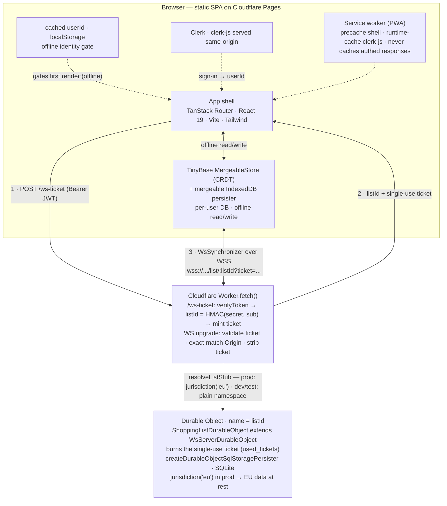

# Architecture

Per-user, local-first shopping list: offline read+write on every device, auto-merge across a user's
devices, and list content at rest in the EU.

> New to an acronym here? See the [glossary](../reference/glossary.md).

## Test coverage

Client logic runs under Vitest (jsdom) in
`src/client/**`; the sync server runs under `@cloudflare/vitest-pool-workers` (miniflare) in
`src/server/__tests__/`. Two Playwright tiers exercise the browser:

- **Local-only** ([../../e2e/local/](../../e2e/local/)) — offline cold-boot, drag reorder, multi-tab
  persistence. Runs against a `vite preview` build with the sync server off (`VITE_SYNC_URL` empty)
  and Clerk's network blocked, so the app boots from a seeded cached identity
  ([../../e2e/local/fixtures.ts](../../e2e/local/fixtures.ts)). Hermetic, so it runs unconditionally
  in CI.
- **Sync** ([../../e2e/sync/](../../e2e/sync/),
  [../../playwright.config.sync.ts](../../playwright.config.sync.ts)) — real Clerk via
  `@clerk/testing` against a local `wrangler dev` Worker, provisioning a fresh `+clerk_test` user
  per test (each gets an isolated HMAC `listId` and a clean Durable Object). Covers live two-context
  CRDT merge, cross-user isolation, and sign-out clearing local data. CI runs it only when
  `CLERK_SECRET_KEY` is present.

Source: [../../src/client/store/](../../src/client/store/),
[../../src/client/components/](../../src/client/components/),
[../../src/server/](../../src/server/).

## Diagram

Renders on GitHub. The numbered edges are the connection handshake in order.

## Components

| Component | Role | Location |
|---|---|---|
| SPA shell | Routing, auth UI, app shell | [../../src/client/routes/__root.tsx](../../src/client/routes/__root.tsx), [../../src/client/router.tsx](../../src/client/router.tsx) |
| Clerk (client) | Identity provider: `ClerkProvider` + `useAuth` | [../../src/client/routes/__root.tsx](../../src/client/routes/__root.tsx), [../../src/client/env.ts](../../src/client/env.ts) |
| Cached identity gate | `{userId}` in localStorage; renders the app offline, independent of Clerk readiness | [../../src/client/store/identity.ts](../../src/client/store/identity.ts) |
| Local store | TinyBase `MergeableStore` (CRDT) ⇄ a mergeable `IndexedDB` persister that preserves HLCs and tombstones across reload; DB `shopping-<userId>` | [../../src/client/store/schema.ts](../../src/client/store/schema.ts), [../../src/client/store/store.ts](../../src/client/store/store.ts), [../../src/client/store/persister.ts](../../src/client/store/persister.ts) |
| Shopping list UI | Two lists (unchecked/checked), search, rename, quantity, delete, drag-reorder | [../../src/client/components/ShoppingList/](../../src/client/components/ShoppingList/) |
| Sign-out teardown | Deletes the local IndexedDB replica and broadcasts to peer tabs on any signed-out transition | [../../src/client/store/teardown.ts](../../src/client/store/teardown.ts) |
| Service worker | Precache the SPA shell; runtime-cache the same-origin `clerk-js` served from `/clerk-js/`; the sync Worker origin stays network-only | [../../vite.config.js](../../vite.config.js) |
| Content-Security-Policy | [../../csp/dev.headers](../../csp/dev.headers) is committed and host-pinned for dev/preview; production resolves [../../csp/prod.headers.template](../../csp/prod.headers.template) into `dist/_headers` at build time so no deployment host is committed (see [../adr/0011-deployment-identifiers-out-of-repo.md](../adr/0011-deployment-identifiers-out-of-repo.md)); `yarn check:csp` — a gate CI and `yarn deploy:spa` run, not `yarn build` — fails on drift between the two, a stray placeholder, a `dist/` with no policy, or a Report-Only template without an explicit opt-in | [../../scripts/check-csp.mjs](../../scripts/check-csp.mjs), [../../scripts/gen-headers.mjs](../../scripts/gen-headers.mjs) |
| `/ws-ticket` endpoint | Verifies the Clerk JWT (`verifyClerkUser`), derives `listId` and mints a single-use WS ticket (`deriveListId`, `mintTicket`) | [../../src/server/index.ts](../../src/server/index.ts), [../../src/server/clerk.ts](../../src/server/clerk.ts), [../../src/server/auth.ts](../../src/server/auth.ts) |
| WS upgrade handler | Validates the ticket and checks `Origin` (`verifyTicket`, `originAllowed`), forwards to the EU Durable Object, which burns the ticket | [../../src/server/index.ts](../../src/server/index.ts), [../../src/server/auth.ts](../../src/server/auth.ts) |
| Durable Object | `ShoppingListDurableObject`, one per `listId`, `jurisdiction('eu')` in prod, SQLite-backed | [../../src/server/durable-object.ts](../../src/server/durable-object.ts) |

Constraints met: **local-first** (CRDT in IndexedDB, offline r/w, conflict-free), **EU residency**
(the DO is pinned `eu`), and **per-user with a path to sharing** (one DO per `listId`; a membership
layer is addable later without re-keying — see
[../adr/0006-deterministic-hmac-listid.md](../adr/0006-deterministic-hmac-listid.md)).

## Design & UX

Decisions that aren't obvious from the markup:

- **Reorder** — dnd-kit, whole-row drag: press-and-hold on touch (220 ms activation delay so a
  vertical swipe still scrolls), 6 px on mouse, plus keyboard reorder; disabled while the
  add/search input is focused. See [../adr/0008-dnd-kit-reorder.md](../adr/0008-dnd-kit-reorder.md).
- **Swipe-to-delete & undo** — on touch, a left-swipe reveals a growing red action pill that
  brightens past a one-third-width commit threshold. Only a finger-lift past the threshold commits;
  any `touchcancel` (edge back-swipe, shade pull, app-switch) springs back, so a destructive action
  never fires on an interrupted gesture. A commit slides the row off and shows a 5s Undo snackbar
  (`role="status"`) that restores the item via `store.setRow` under the same rowId, preserving its
  `(position, id)` order. The gesture tracks a single `Touch.identifier`, is suppressed during a
  drag, and is blocked from starting (but never torn down) while syncing. Delete is also reachable
  without touch via the row's edit mode.
  [../../src/client/components/ShoppingList/useSwipeToDelete.ts](../../src/client/components/ShoppingList/useSwipeToDelete.ts),
  [UndoSnackbar.tsx](../../src/client/components/ShoppingList/UndoSnackbar.tsx).
- **Focus & keyboard** — mutations that unmount the focused control return focus to a button rather
  than dropping it to `<body>`: rename/quantity commits refocus the row, delete moves to a
  neighbour, Undo returns to the restored item. Each only reclaims focus that was genuinely lost, so
  it never steals focus the user moved on purpose, and always targets a button so it can't pop the
  soft keyboard.
  [../../src/client/components/ShoppingList/useListActions.ts](../../src/client/components/ShoppingList/useListActions.ts),
  [ItemRow.tsx](../../src/client/components/ShoppingList/ItemRow.tsx).
- **Internationalisation** — FR/EN via a typed dictionary
  ([../../src/client/i18n/](../../src/client/i18n/)); English keys are the source of truth, so a
  missing French key is a compile error, and `t(key, vars)` interpolates `{name}`/`{count}` and
  picks a `{ one, other }` plural form by `count` via the locale's `Intl.PluralRules`. The
  chosen language is a synced CRDT value (`VALUES_SCHEMA.locale`) mirrored to `localStorage` so it's
  readable above `StoreProvider` — that mirror drives both the app UI and Clerk's own strings
  (`@clerk/localizations`).
  [../../src/client/routes/__root.tsx](../../src/client/routes/__root.tsx).
- **Theme** — light and dark, following `prefers-color-scheme`. The butter accent holds in both and
  `--color-accent-text` swaps to a readable tone per theme. A lighter header (`--color-header`) over
  a darker canvas (`--color-canvas`) is held by dedicated tokens because `surface`/`surface-2` don't
  keep a consistent lightness order across themes. Clerk's own components follow the same light/dark
  via `@clerk/themes`. [../../src/client/styles.css](../../src/client/styles.css).
- **Motion** — add/check/delete animate through the View Transitions API (`flushSync` commits the
  store change before the API snapshots; each row carries a `view-transition-name`, and rows in a
  collapsed section render at `opacity: 0` so a named element isn't lifted out of its clip).
  Title-collapse and the checked-section fold use CSS `grid-template-rows`; swipe-to-delete tracks
  the finger with a CSS transform and springs back with a CSS transition, and crossing the delete
  threshold plays a short CSS keyframe pulse. Motion is CSS-driven (no hand-rolled JS animation) and
  all of it is gated on `prefers-reduced-motion`.
  [../../src/client/components/ShoppingList/helpers.ts](../../src/client/components/ShoppingList/helpers.ts),
  [ItemRow.tsx](../../src/client/components/ShoppingList/ItemRow.tsx).
- **Scroll restoration** — page-level scroll under a sticky header; the offset is persisted to
  `sessionStorage` and re-applied before paint in a `useLayoutEffect` once rows exist.
  `history.scrollRestoration` is `manual`, and `StoreProvider` withholds the list until the local
  load resolves so it paints populated and already-scrolled.
  [../../src/client/main.tsx](../../src/client/main.tsx),
  [../../src/client/store/StoreProvider.tsx](../../src/client/store/StoreProvider.tsx).
- **Insecure-context ids** — `newItemId` falls back to `crypto.getRandomValues` when
  `crypto.randomUUID` is unavailable (non-secure origins, e.g. a `http://` LAN IP during device
  testing). [../../src/client/store/store.ts](../../src/client/store/store.ts).

## EU residency

The hard constraint is data residency in the EU. The design meets it for **data at rest**, not for
every hop or every actor. The caveats matter — this is not "EU sovereign":

- **At rest, not in transit.** Every request first lands on the nearest Cloudflare edge PoP before
  reaching the `eu` Durable Object; for a travelling user that PoP can be outside the EU.
- **The DO `id` is logged outside the jurisdiction.** Cloudflare's request logging is not itself
  pinned to `eu`; the DO identifier (not the list content) can appear in logs processed elsewhere.
- **Clients hold full local replicas** wherever the device physically is — "at rest in the EU"
  describes the server copy, not every copy.
- **Clerk stores identity data in the US.** Only the list content is pinned; auth and profile data
  are out of scope.
- **`jurisdiction('eu')` is a Cloudflare region, not a specific member state, and not legal
  sovereignty.** There's no control over the operator and no assurance against non-EU legal process
  reaching Cloudflare. True sovereignty would mean an EU-domiciled operator (e.g. OVH, Scaleway) —
  out of scope here.

DO SQLite is encrypted at rest (Cloudflare-managed), which is a security property, not a residency
one. See [../adr/0004-eu-residency-cloudflare.md](../adr/0004-eu-residency-cloudflare.md).
</invoke>
